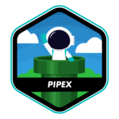
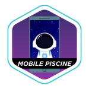

# Ahhhh shit, are u here? U look so pretty 🤭!!!
## 🙋🏽‍♂️ ABOUT ME (a soon intro)!
### My name is Vinicius, but you may call me Vinny.
I am a student at School 42 (Sao Paulo Campus). I'm doing the 42.Zip C Programming while studying Python beside

## 👀 GET TO KNOW ME!
### These are the languages I've been learing and working with

### Beside them, I'm interested in learning

 

### I'm used to these IDE, Terminal & Os 

### and on a daily bases, there are the most common platforms use

## 42.ZIP PROJECTS | C PROGRAMING COURSE

## 🛸 WAYS TO CONTACT ME!
### If you're interested, you can hit me up through LinkedIn, Gmail or Discord (links below)

