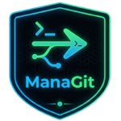
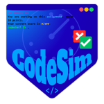
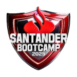

# Salutations from Brasil!!! (Yes, with an S 🤭)
## 🙋🏽‍♂️ ABOUT ME (a short intro)
### My name is Vinicius, but you may call me Vinny.
#### I'm a student at 42 (São Paulo Campus), where I took the 42.Zip programming course and now I am taking the New Common Core Software Engineering course. I'm also diving deep into Python programming. Around here, you’ll see some projects I've done as part of the courses I've taken and others just for fun...😊
#### Enjoy exploring my portfolio and feel free to connect and chat with me!

## PROJECTS YOU MAY FIND INTERESTING
| ManaGit | CodeSim| Minishell |
| :-: | :-: | :-: |
|  |  |  |

## 👀 GET TO KNOW ME BETTER!
### My main stacks

### Stacks I already worked with

### Stacks I've been studying

### I'm used to work with these IDE & OS 

### I'm used to version my code with

### and the way I communicate throughout my day

## 🤝🏽 My GitHub Contributions
<picture>
  <source media="(prefers-color-scheme: dark)" srcset="https://raw.githubusercontent.com/vgomes-p/vgomes-p/output/github-snake-dark.svg" />
  <source media="(prefers-color-scheme: light)" srcset="https://raw.githubusercontent.com/vgomes-p/vgomes-p/output/github-snake.svg" />
  
</picture>

<!--## COURSES' PATHWAY

-->

## 🛸 WAYS TO CONTACT ME!
### If you're interested, you can hit me up through LinkedIn, Gmail or Discord (links below)

